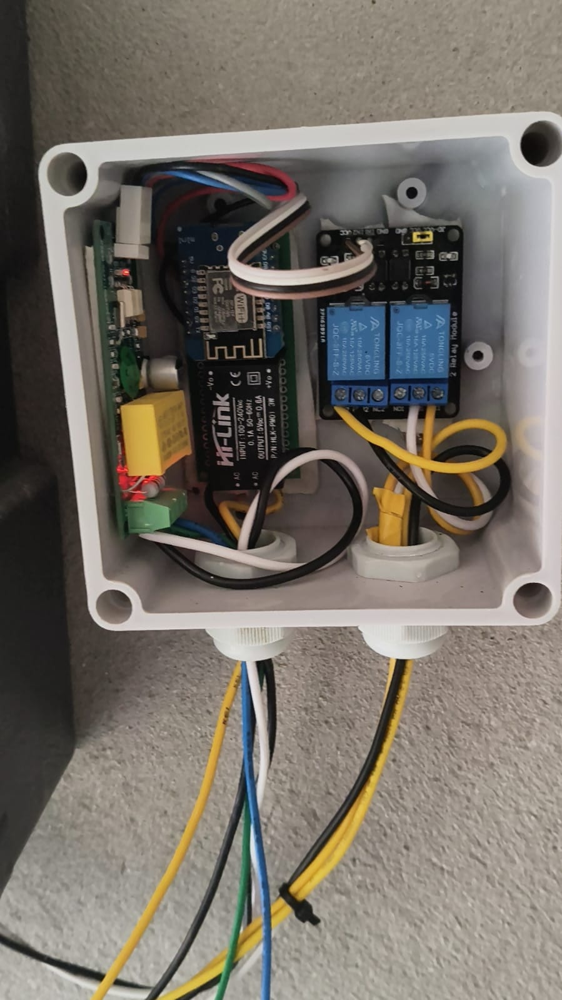
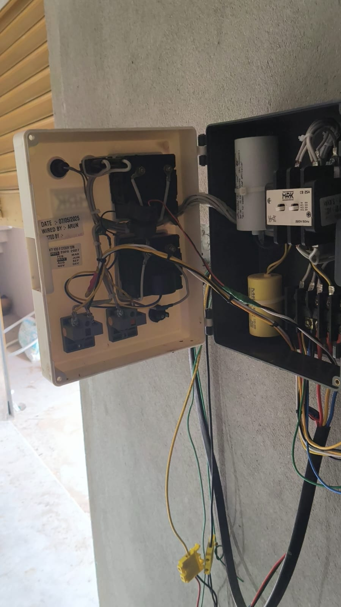
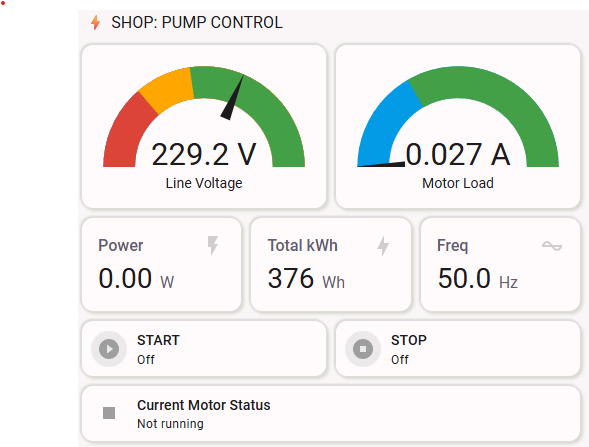
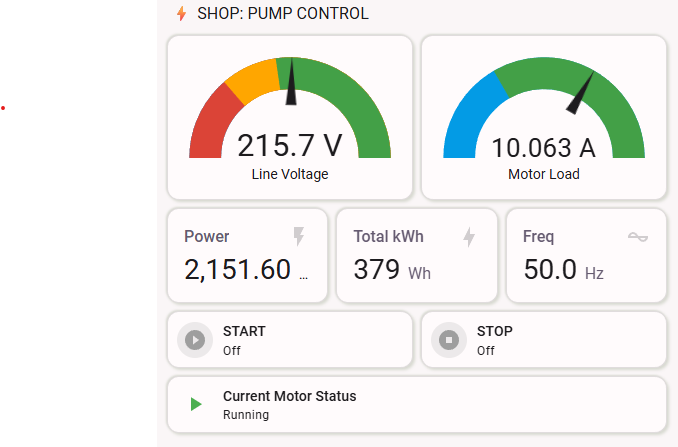

# 🚰 Smart Submersible Pump Controller (ESPHome)

An advanced IoT solution for single-phase submersible pumps. This project replaces or augments your manual motor starter with a smart, WiFi-enabled controller featuring **Dry-Run Protection**, **Energy Monitoring**, and **Real-time Feedback**.

---

## 📸 Project Showcase

### Hardware Build

  
  

### Home Assistant Dashboard

  
  

---

## 📺 Video Demo
Experience the smart controller in action. See the real-time feedback and relay switching.

  <video src="demo.mp4" width="100%" controls>
    Your browser does not support the video tag.
  </video>

---

## ✨ Key Features

- **Dual-Phase Control:** Precise 2-second pulses for Start and Stop relays.
- **Dry-Run Protection:** Automatically shuts down the motor if current (Amps) drops below a safe threshold.
- **Power Monitoring:** Real-time Voltage, Current (Amps), Watts, and Total Energy (kWh) tracking via PZEM-004T.
- **Dual SSID Support:** Automatically switches between primary and secondary WiFi networks.
- **Industrial Dashboard:** Attractive, high-visibility Home Assistant UI with dynamic color-coded buttons.

---

## 🛠 Hardware Required

| Component | Purpose |
| :--- | :--- |
| **Wemos D1 Mini** | The Brain (ESP8266) |
| **PZEM-004T V3.0** | AC Energy Monitoring & Protection |
| **2-Channel Relay** | High-Voltage Switching (Start/Stop) |
| **Hi-Link HLK-PM01** | 5V DC Isolated Power Supply |

---

## 📐 Wiring Guide

### Pin Mapping:
- **Relay 1 (Start):** GPIO5 (D1)
- **Relay 2 (Stop):** GPIO4 (D2)
- **PZEM RX:** GPIO14 (D5)
- **PZEM TX:** GPIO12 (D6)

---

## 🤝 Credits & Contributions

This project was made possible with contributions and technical guidance from:

- **Lead Developer:** [Your Name/Blog Name]
- **Technical Contributor:** [@manoranjan2050](https://github.com/manoranjan2050)

---

## ⚠️ Safety Disclaimer

> **DANGER: HIGH VOLTAGE.** This project involves 230V AC wiring. Improper installation can lead to electrical shock, fire, or damage to your motor. Always disconnect the main breaker before working on the panel.

## 📝 License
Licensed under the MIT License.